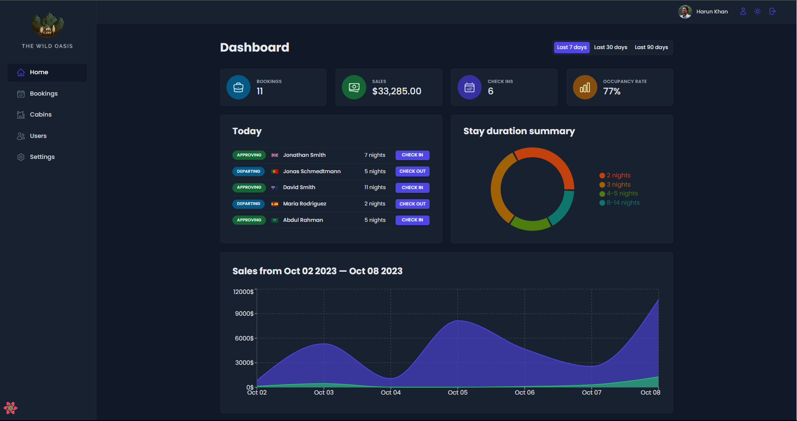
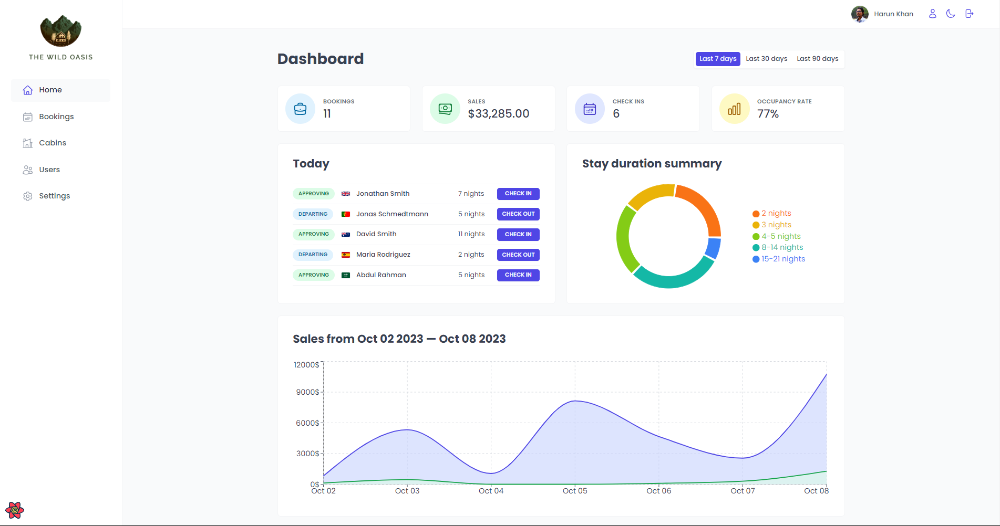
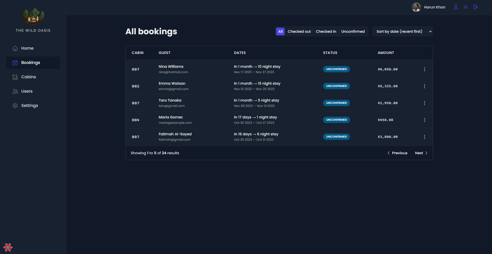
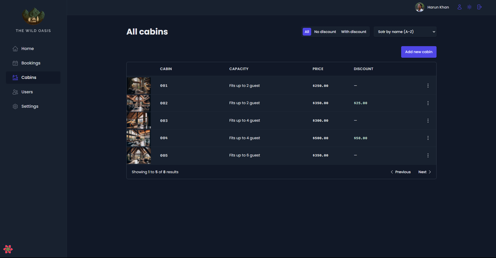
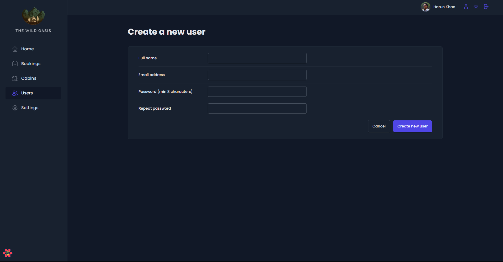
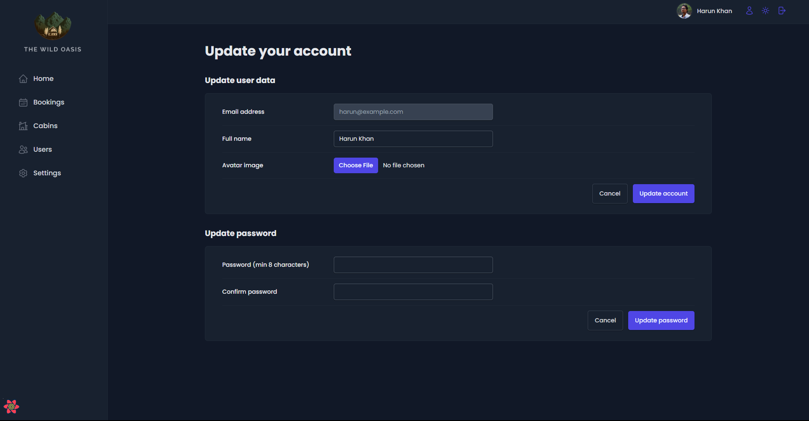
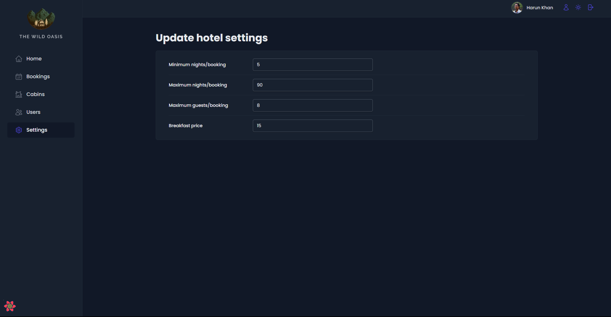

# Hotel Booking App

## [`Live Link`](https://hotel-bookings-app.vercel.app/)

## Test Account Credentials

- Email Address : `harun@example.com`
- Password : `pass1234`

## Tech Stack

&nbsp;&nbsp;
&nbsp;&nbsp;
&nbsp;&nbsp;
&nbsp;&nbsp;
&nbsp;&nbsp;
&nbsp;&nbsp;
&nbsp;&nbsp;
&nbsp;&nbsp;

## Features

- **`Hotel booking app`** is a **`Single Page Application`** Admin Dashboard built with **`React`**. **`Supabase`** is used as the backend and **`React Query`** is used for remote state management. **`Styled Components`** is used for styling and **`Recharts`** is used for displaying charts, **`React Hot Toast`** for displaying toast messages, **`React Router`** for navigation and routing, **`React Hook Form`** for complex form handling and validation.

- The **`Admin dashboard`** for Hotel Cabins also has **`dark and light`** mode. Users of the **`Web-App`** are the hotel employees.

- **`Users`** can view all the **`cabins`**, **`booking`** and their **`account`** details, change their avatar, name and password and they can create other users also.

- **`Cabins`** and **`Bookings`** can be **`filtered`** by **`status`** and **`sorted`** by name, date etc. including **`pagination`**.

- **`Users`** can add, edit, delete and **`cabins`**, add cabin images. They can check-in and check-out **`guests`** and confirm their payment and they can also change **`settings`** of the hotel such as breakfast price, max guests etc.

- **`Dashboard`** shows **`statistics`** of the hotel like total bookings, total cabins, total guests, total sales, charts for sales and bookings. Users can toggle details between durations - **`7, 30 and 90 days`**.

## Screenshots

- #### Dashboard - Dark Mode

  

- #### Dashboard - Light Mode

  

- #### Bookings Page

  

- #### Cabins Page

  

- #### New user create Page

  

- #### User Account Page

  

- #### Settings Page

  
